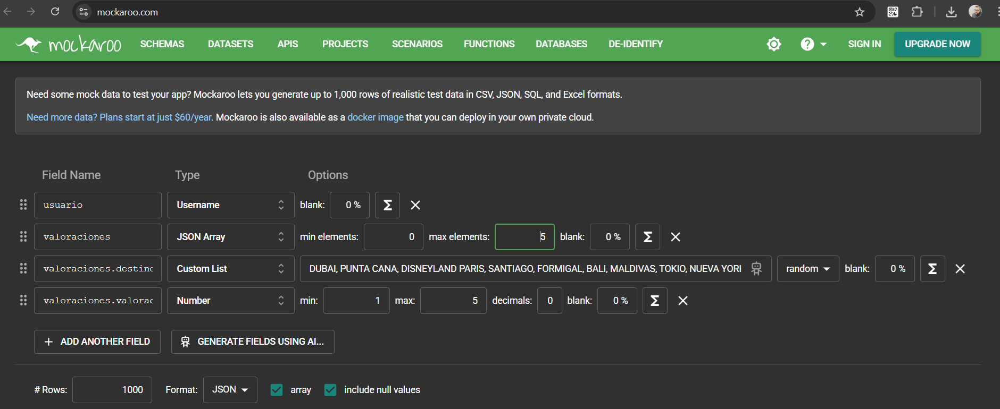
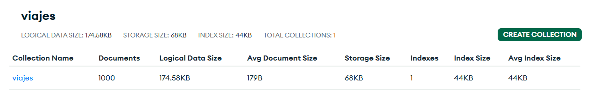

# Caso Práctico de Transformación Digital: Recomendador de Viajes Inteligente
Este proyecto es una simulación práctica de un proceso de transformación digital con enfoque consultivo y tecnológico. El objetivo es acompañar al cliente en la mejora de su sistema actual, integrando tecnologías basadas en IA y metodologías centradas en el usuario, como **Design Thinking**.

No se trata de un desarrollo puramente académico ni únicamente técnico, sino de una aproximación realista, donde el foco principal es **identificar oportunidades de mejora a través de la empatía, el análisis del usuario y la tecnología aplicada a negocio**. Para más contexto, consulte el documento caso práctico (PDF).

## 1. Investigación y análisis: Enfocados en el cliente
La primera fase consiste en **entender el problema desde la perspectiva del cliente y sus usuarios**. Observamos una pérdida progresiva de clientes y buscamos comprender sus causas. Para ello, empleamos la metodología **Design Thinking**, comenzando por la etapa de empatía e investigación.

### Fases iniciales:
* **Entrevistas cualitativas** a perfiles representativos.

* **Análisis de datos** del sistema actual.

* **Identificación de patrones de comportamiento y frustraciones del usuario**.

A partir del análisis de los datos y los testimonios, clasificamos a los usuarios según sus necesidades y comportamientos. Este mapeo contextual es clave para segmentar adecuadamente y ofrecer soluciones adaptadas:

### Arquetipos de usuarios
Definimos ejes estratégicos como:

* **Sensibilidad al coste** (de menor a mayor disposición a pagar).

* **Grado de planificación** (viajeros espontáneos vs. planificadores).

Esto nos permite construir **arquetipos**, una herramienta de consultoría clave para alinear las soluciones con las expectativas reales del mercado objetivo.

Esta segmentación nos orienta a propuestas viables, alineadas con los **valores del cliente y la visión estratégica**: tecnología, accesibilidad y eficiencia en costes.

## 2. User Persona y Mapa de Empatía: Diseñando desde la empatía
Creamos perfiles ficticios basados en datos reales para empatizar con los usuarios. Utilizamos herramientas generativas para visualizar mejor a nuestros user persona. Por ejemplo, presentamos a **Don Félix Aguirre**, un viajero planificador, sensible al coste y a la tecnología:

Con esta representación podemos entender qué:

* **Ve** (la publicidad y la competencia),

* **Escucha** (opiniones de otros usuarios),

* **Dice y hace** (tendencias de comportamiento),

* **Siente y piensa** (inquietudes y deseos ocultos).

Esto alimenta un **mapa de hallazgos** que nos permite transformar problemas latentes en **insights accionables**:

### Descubrimientos clave (Insights):
* Necesidad de simplificar la toma de decisiones.

* Interés en packs y destinos ajustados a su perfil.

* Búsqueda de valor en la experiencia completa, no solo en el precio.

### Oportunidades detectadas:
* Sugerencias personalizadas y automatizadas de viajes económicos.

* Integración de paquetes destino + actividades de interés.

* Conectividad con redes sociales para inspirar decisiones.

* Sistema de notificaciones con ofertas relevantes.

De entre varias posibles soluciones, seleccionamos la más viable y con mayor impacto:
👉 **Desarrollar un sistema de recomendación inteligente basado en IA**.

## 3. Desarrollo técnico: Sistema de Recomendación Basado en IA
Desde el punto de vista técnico, se ha desarrollado un **recomendador de viajes** inspirado en el comportamiento social y el análisis colaborativo. Este sistema explota el concepto de "aprendizaje social": imitamos lo que gusta a otros como nosotros.

### Tecnología aplicada
Se utiliza el **coeficiente de correlación de Pearson** para evaluar similitudes entre perfiles de usuario y predecir destinos atractivos.

🔍 **Objetivos técnicos y de negocio**:

* Aumentar la personalización y retención.

* Crear una comunidad de usuarios.

* Mejorar la conversión con sugerencias inteligentes.

* Alinear la solución con objetivos de marketing digital.

Este prototipo puede ser extendido con modelos más avanzados (deep learning, clustering, etc.) o integrarse en una app/web escalable.

#### Datos
Los datos han sido generados, en formato JSON, mediante la herramienta [mockaroo](https://www.mockaroo.com/) siguiendo el siguiente esquema:
.

Los datos pueden ser encontrados en el archivo [MOCK_DATA.json](./data/MOCK_DATA.json).

Como puede observarse tenemos subidos los datos a un cluster de MongoDB
.

### Integración web y UX

## Conclusión
Este caso práctico muestra cómo desde la consultoría estratégica podemos acompañar a un cliente en su transformación digital, con un enfoque centrado en:

* El **usuario** (empatía, arquetipos),

* El **valor de negocio** (oportunidades, viabilidad),

* Y la **tecnología** (recomendador con IA) como medio para lograrlo.

La combinación de Design Thinking con soluciones técnicas concretas es una herramienta poderosa para diseñar productos digitales alineados con necesidades reales y visión empresarial.

¿Te gustaría escalar este caso a un entorno real o conectarlo con datos productivos?
Contáctame o revisa el [caso práctico en PDF](./caso%20práctico.pdf) para más detalles.