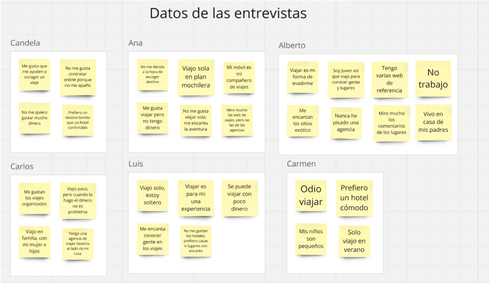
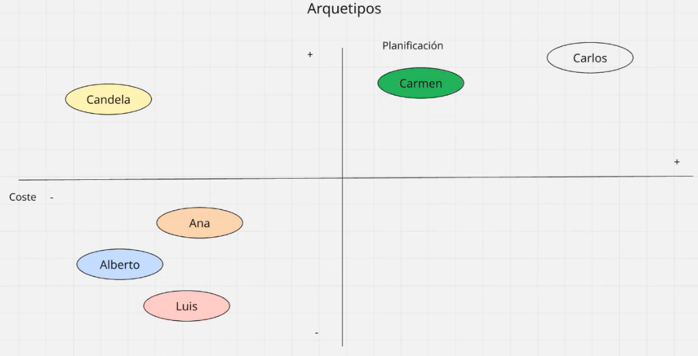
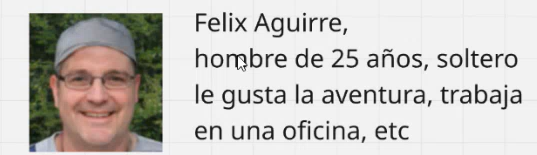
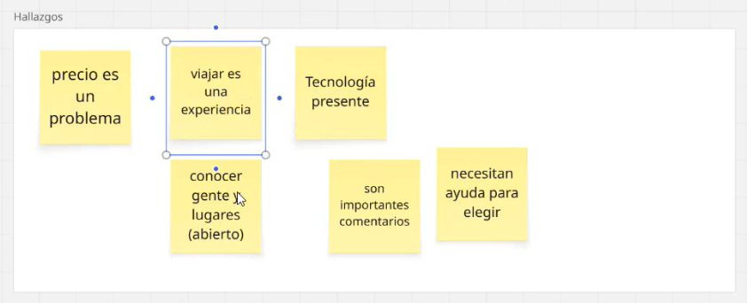

# 🎯Caso Práctico de Transformación Digital: Recomendador de Viajes Inteligente
Este proyecto es una simulación práctica de un proceso de transformación digital con enfoque consultivo y tecnológico. El objetivo es acompañar al cliente en la mejora de su sistema actual, integrando tecnologías basadas en IA y metodologías centradas en el usuario, como **Design Thinking**.

No se trata de un desarrollo puramente académico ni únicamente técnico, sino de una aproximación realista, donde el foco principal es **identificar oportunidades de mejora a través de la empatía, el análisis del usuario y la tecnología aplicada a negocio**. Para más contexto, consulte el documento caso práctico (PDF).

## 🔍1. Investigación y análisis: Enfocados en el cliente
La primera fase consiste en **entender el problema desde la perspectiva del cliente y sus usuarios**. Observamos una pérdida progresiva de clientes y buscamos comprender sus causas. Para ello, empleamos la metodología **Design Thinking**, comenzando por la etapa de empatía e investigación.

### 🧠Fases iniciales:
* **Entrevistas cualitativas** a perfiles representativos.

* **Análisis de datos** del sistema actual.

* **Identificación de patrones de comportamiento y frustraciones del usuario**.



A partir del análisis de los datos y los testimonios, clasificamos a los usuarios según sus necesidades y comportamientos. Este mapeo contextual es clave para segmentar adecuadamente y ofrecer soluciones adaptadas:


### 👤Arquetipos de usuarios
Definimos ejes estratégicos como:

* **Sensibilidad al coste** (de menor a mayor disposición a pagar).

* **Grado de planificación** (viajeros espontáneos vs. planificadores).

Esto nos permite construir **arquetipos**, una herramienta de consultoría clave para alinear las soluciones con las expectativas reales del mercado objetivo.




Esta segmentación nos orienta a propuestas viables, alineadas con los **valores del cliente y la visión estratégica**: tecnología, accesibilidad y eficiencia en costes.

## 🤝2. User Persona y Mapa de Empatía: Diseñando desde la empatía
Creamos perfiles ficticios basados en datos reales para empatizar con los usuarios. Utilizamos herramientas generativas para visualizar mejor a nuestros user persona. Por ejemplo, presentamos a **Don Félix Aguirre**, un viajero planificador, sensible al coste y a la tecnología:



Con esta representación podemos entender qué:

* **Ve** (la publicidad y la competencia),

* **Escucha** (opiniones de otros usuarios),

* **Dice y hace** (tendencias de comportamiento),

* **Siente y piensa** (inquietudes y deseos ocultos).

Esto alimenta un **mapa de hallazgos** que nos permite transformar problemas latentes en **insights accionables**:



### 🧭Descubrimientos clave (Insights):
* Necesidad de simplificar la toma de decisiones.

* Interés en packs y destinos ajustados a su perfil.

* Búsqueda de valor en la experiencia completa, no solo en el precio.

### 💡Oportunidades detectadas:
* Sugerencias personalizadas y automatizadas de viajes económicos.

* Integración de paquetes destino + actividades de interés.

* Conectividad con redes sociales para inspirar decisiones.

* Sistema de notificaciones con ofertas relevantes.

De entre varias posibles soluciones, seleccionamos la más viable y con mayor impacto:
👉 **Desarrollar un sistema de recomendación inteligente basado en IA**.

## 🛠️3. Desarrollo técnico: Sistema de Recomendación Inteligente + Interfaz Web
Una vez identificada la oportunidad, pasamos a la **fase de ideación, prototipado y testeo**, desarrollando un sistema que ofrezca **sugerencias de destinos personalizados**. La solución técnica se compone de dos partes:

1. **Un motor de recomendación por filtrado colaborativo.**
2. **Una interfaz web funcionaly navegable construida con tecnologías ligeras.**

Esta fase mantiene un enfoque lean, validando la propuesta con una solución mínima viable y extensible, priorizando la utilidad sobre la complejidad técnica inicial.


### 🧮Algoritmo de recomendación
La lógica del recomendador está basada en el **filtrado colaborativo basado en usuarios**, utilizando el **coeficiente de correlación de Pearson** para encontrar usuarios con gustos similares.

Este enfoque permite ofrecer sugerencias personalizadas imitando el comportamiento colectivo: 

> “Usuarios similares a ti disfrutaron estos destinos”.

🔍 **Objetivos técnicos y de negocio**:

* Incrementar la **relevancia** de las recomendaciones.

* Favorecer la **retención** mediante experiencias personalizadas.

* Aprovechar datos existentes sin necesidad de conocimiento profundo del contenido.

* Abrir puertas a una **evolución futura** hacia técnicas más complejas (como clustering, embedding o modelos híbridos).

### 🧩 Estructura del sistema
El proyecto ha sido organizado de forma modular y escalable, facilitando tanto el desarrollo como su futura integración en entornos reales:

```php
src/
├── app.py               # Punto de entrada Flask
├── recommender.py       # Motor de recomendaciones (Pearson)
├── data/
│   └── MOCK_DATA.json   # Dataset generado con Mockaroo
├── templates/
│   ├── layout.html      # Plantilla base (Bootstrap)
│   ├── home.html        # Pantalla principal
│   ├── recommend.html   # Resultados de recomendación
├── static/
│   └── styles.css       # Personalización visual (si se desea)

```

### 🧪 Datos y simulación realista

Los datos han sido generados con [Mockaroo](https://www.mockaroo.com/) para simular preferencias de usuarios sobre múltiples destinos. Se subieron a un **clúster de MongoDB Atlas**, simulando una infraestructura en la nube típica de un entorno productivo.
📦 Puedes consultar el archivo [MOCK_DATA.json](./data/MOCK_DATA.json).


### 🌐 Interfaz Web funcional
El sistema cuenta con una interfaz web construida con **Flask** (Python) y **Bootstrap** (CSS). Este front permite:

* Seleccionar un usuario ficticio.

* Ver recomendaciones personalizadas en segundos.

* Simular flujos básicos de un producto real sin necesidad de login ni API externa.

🚀 Este MVP (Producto Mínimo Viable) puede ser fácilmente desplegado en un servidor local o en la nube (Render, Heroku, etc.).

### 🚧Futuras mejoras
Este es un **prototipo funcional**, y como consultores, identificamos rápidamente caminos de evolución como:

* Integración de feedback real de usuarios (sistema de rating).

* Implementación de **recomendación híbrida** (contenido + colaboración).

* Exportación a una Progressive Web App (PWA) o integración en un CRM.

* Automatización del despliegue en cloud (CI/CD).

## ✅4. Conclusión
Este proyecto combina:

* Investigación cualitativa con herramientas de Design Thinking,
* Tecnología útil y realista aplicada a negocio,
* Diseño modular y escalable listo para producción.

Es un ejemplo de cómo consultoría, UX y tecnología pueden trabajar juntos en procesos de transformación digital centrados en el cliente.

¿Listo para llevar tu solución al siguiente nivel?
📩 [Contacta](mailto:mqggonzalez@gmail.com) o revisa el [caso práctico en PDF](./caso%20práctico.pdf)  para más información.